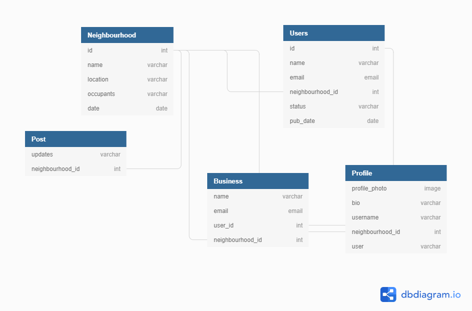

## Application name
Neighbourhood-Watch

[](https://opensource.org/licenses/MIT)

## DB Design



## Description
This application allows people in a particular neighbourhood to connect with each other and post updates on different things happening in a particular neighbourhood.
The users are also able to see different businesses happening in a particular neighbourhood.


## Features
The main features include joing a particular neighbourhood,posting updates on that particular neighbourhood.
Users can also create profiles.
Neighbourhood admins can create a neighbourgood and also delete it.
One can login as neighbourhood admin or as a user depending on your authority.


## Technologies used

Django 3.0.3.
Bootstrap
Python3.6
Postgresql
Postman

# INSTALLATION

## Clone
```
https://github.com/marknesh/Neighbourhood-Watch.git

```

## Create a virtual environment
```
python3.6 -m venv --without-pip virtual

```
## Run migration
```
python3.6 manage.py makemigrations
python3.6 manage.py migrate

```
## Run server
```
python3.6 manage.py runserver

```
## Run test
```
python3.6 manage.py test
```

## Troubleshooting
If you encounter any problems please feel free to contact me using the contacts provided  below incase you encounter any bugs.

## Support and contact details
Contact us on : 070986876
Email us on: Securehood@gmail.com

## Author
[marknesh]


